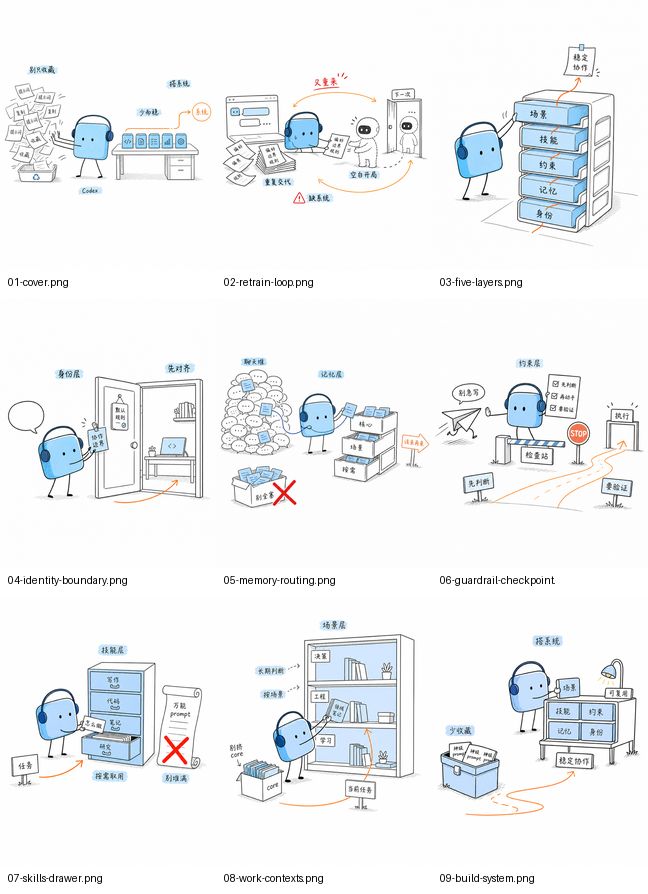

# Bluegrid Xiaohongshu Illustrations

小蓝格是一个用于小红书图文和中文内容配图的个人视觉 IP skill：天蓝色圆角方块、黑点眼、细线四肢、深蓝细线耳机，气质是安静的内容系统操作员。

这个 skill 适合把中文观点、方法论、AI 工作流、个人系统、内容创作流程等主题，转成清爽、简约、有留白的小红书 4:5 配图。文章正文场景也支持 16:9 横版。

## Example Gallery

这些图片来自 Obsidian 自媒体库里的真实小红书卡片项目，用作风格校准样例。它们展示“小蓝格耳机 IP”在同一组选题下的稳定性：清新蓝、手绘线稿、少量橙色路径、红色纠偏、白底留白和低科技隐喻。



| Image | Use Case |
| --- | --- |
| `01-cover.png` | 封面：从收藏提示词到搭系统 |
| `02-retrain-loop.png` | 反复重新培训 Agent 的痛点 |
| `03-five-layers.png` | 五层架构总图 |
| `04-identity-boundary.png` | 身份层和协作边界 |
| `05-memory-routing.png` | 记忆分层和路由 |
| `06-guardrail-checkpoint.png` | 约束层和检查点 |
| `07-skills-drawer.png` | Skill 抽屉和按需取用 |
| `08-work-contexts.png` | Work contexts 场景库 |
| `09-build-system.png` | 从提示词收藏到协作系统 |

## When To Use

- 你要为小红书图文生成一张或一组简约配图。
- 你要给中文文章、Notion 文档、方法论或 AI 工作流配图。
- 你想用固定 IP 角色“小蓝格”保持系列内容视觉一致。
- 你需要先出 shot list、再生成单张图或整组图。
- 你需要修复生成图的 PPT 感、可爱感、耳机缺失、文字过多或左上角标题。

## Install

Copy this skill directory into your Codex skills directory:

```bash
mkdir -p "$CODEX_HOME/skills"
cp -R skills/bluegrid-xhs-illustrations "$CODEX_HOME/skills/"
```

Set `CODEX_HOME` to your local Codex configuration directory if it is not already defined.

## Usage

Generate a Xiaohongshu image:

```text
Use $bluegrid-xhs-illustrations to generate a 4:5 Xiaohongshu illustration for: 为什么收藏很多素材还是写不出东西。
```

Ask for a shot list first:

```text
用小蓝格风格给这篇小红书笔记做配图方案，先别生成图。
```

Generate an article body illustration:

```text
用小蓝格风格给这段文章生成一张 16:9 正文配图：AI 工作流失败通常不是工具少，而是输入输出不清楚。
```

Repair a weak image:

```text
这张图太像 PPT，小蓝格只是站在旁边。用 $bluegrid-xhs-illustrations 的规则改一下。
```

## Prompt Pack

See [examples/prompts.md](examples/prompts.md) for reusable prompts based on the real example images.

## Evaluation

- [evals/trigger-prompts.csv](evals/trigger-prompts.csv): trigger and non-trigger coverage.
- [evals/golden-prompts.csv](evals/golden-prompts.csv): representative prompt-level regression cases.
- [evals/visual-rubric.md](evals/visual-rubric.md): ten-point visual quality rubric.
- [examples/images/](examples/images/): real image baselines for style calibration.

Images below 8/10 on the visual rubric should not be used as final outputs without repair.

## Notes

The examples are calibration assets, not layouts to copy. Future images should preserve the IP and visual DNA while inventing fresh metaphors for the current content.

